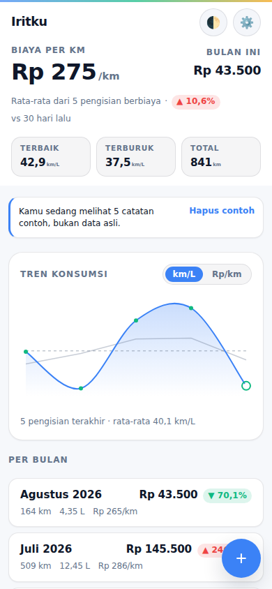
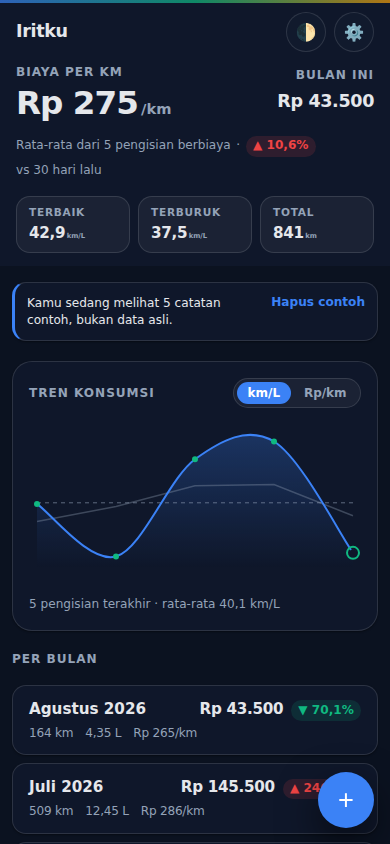

# Iritku

**Catat bensin, tahu Rp/km.**

Iritku adalah Progressive Web App mobile-first untuk pemotor yang ingin tahu
berapa sebenarnya biaya jalan motornya. Kamu mencatat satu kali pengisian —
berapa jauh kamu jalan dan berapa liter yang masuk sampai tangki penuh lagi —
lalu Iritku mengubahnya jadi kilometer per liter dan, yang lebih berguna,
rupiah per kilometer. Isinya satu file `index.html` dengan CSS dan JS inline
plus satu service worker: tanpa build step, tanpa backend, tanpa akun, tanpa
pelacakan. Semua yang kamu masukkan tetap di HP kamu.

Seluruh antarmukanya berbahasa Indonesia.

[**Demo langsung →**](https://fuelio.netlify.app)

## Tangkapan layar

| Mode terang | Mode gelap |
| --- | --- |
|  |  |

## Fitur

### Pelacakan uang

- **Input berbasis Rupiah.** Catat pengisian lewat total nominal, harga per
  liter, atau liter — isi dua dari tiga, sisanya dihitung Iritku.
- **Harga BBM diingat.** Tiap jenis BBM menyimpan harga terakhir yang kamu
  koreksi, jadi entri berikutnya sudah hampir terisi sendiri.
- **Dashboard biaya.** Rupiah per kilometer, pengeluaran bulan ini, dan rincian
  per bulan dengan tren naik/turun dibanding bulan sebelumnya.

### Efisiensi

- **Metode isi penuh.** Cara klasiknya: isi penuh, jalan, isi penuh lagi, lalu
  masukkan jaraknya dan liter yang masuk.
- **Dua mode jarak.** Jarak dari trip meter, atau odometer dengan jarak
  dihitung otomatis dari catatan sebelumnya.
- **Isi sebagian ditangani benar.** Tangki yang belum penuh dicatat terpisah
  dan digabung ke rasio pengisian penuh berikutnya, bukan merusak rata-rata.
- **Grafik tren.** Grafik canvas km/L atau Rp/km dengan scrub sentuh, moving
  average, dan pewarnaan berdasar ambang batas — digambar sendiri, tanpa
  library chart.
- **Riwayat berkode warna.** Tiap kartu pengisian ditandai hijau/kuning/merah
  sesuai efisiensi, jadi tangki yang boros langsung kelihatan.

### Keamanan data

- **Backup dan restore JSON.** Ekspor lengkap, dan alur pemulihan dengan
  pratinjau yang menunjukkan persis apa yang akan terjadi kalau digabung atau
  diganti — sebelum kamu memutuskan.
- **Ekspor CSV.** Ramah Excel (delimiter titik-koma, desimal koma) dan aman
  dari suntikan formula.
- **Karantina, bukan dibuang.** Baris data yang gagal validasi disisihkan dan
  ditampilkan di Pengaturan lengkap dengan ekspor JSON mentah, bukan dihapus
  diam-diam.
- **Migrasi skema otomatis.** Data dari versi aplikasi yang lebih lama terbaca
  tanpa langkah manual apa pun.
- **Penyimpanan transaksional.** Kalau penulisan gagal, aplikasi mengembalikan
  kondisinya dan render ulang, bukan menampilkan layar yang sudah tidak cocok
  dengan penyimpanan. Kuota penyimpanan penuh langsung memunculkan tawaran
  backup.
- **Pengingat backup.** Begitu riwayatmu sudah cukup banyak untuk disayangkan
  kalau hilang, Iritku mengingatkan untuk ekspor — bisa ditutup, tidak pernah
  memblokir.

### PWA

- **Dukungan offline sungguhan.** Service worker satu-origin meng-cache
  aplikasi dan menyajikannya dengan strategi network-first dengan timeout, jadi
  Iritku tetap terbuka walau sama sekali tanpa koneksi.
- **Bisa dipasang.** Manifest dan ikon dibuat saat aplikasi dimuat; ada ajakan
  pasang di dalam aplikasi untuk Android dan desktop, serta petunjuk
  Share-sheet sekali-tampil untuk iOS yang tidak punya prompt pasang bawaan
  browser.
- **Update yang jujur.** Versi baru memunculkan ajakan di dalam aplikasi dengan
  reload eksplisit — bukan pergantian diam-diam saat tab masih terbuka.
- **Mode gelap** mengikuti sistem secara default, bisa diubah manual.
- **Aksesibel secara default.** Kartu riwayat bisa dioperasikan lewat keyboard,
  fokus dikembalikan ke elemen yang membuka dialog, pesan error form diumumkan
  pembaca layar, mode gerakan-minim penuh, dan layar crash yang tetap
  memungkinkanmu mengekspor data.

## Mulai cepat

Iritku harus disajikan lewat **`https://` atau `http://localhost`** — browser
menolak mendaftarkan service worker dari URL `file://`, jadi membuka
`index.html` langsung membuatmu kehilangan dukungan offline dan kemampuan
dipasang (fitur lain tetap jalan). Secara lokal:

```bash
git clone https://github.com/adenaufal/fuelio.git
cd fuelio
python3 -m http.server 8000
# lalu buka http://localhost:8000/
```

Untuk produksi, hosting statis apa pun bisa — Netlify, GitHub Pages, direktori
nginx/Apache biasa. Tidak ada yang perlu di-build atau dikonfigurasi.

## Cara pakai

1. Tap **+** (atau "Catat pengisian pertama" saat pertama buka) untuk mencatat
   pengisian.
2. Isi jarak (trip atau odometer) dan liter; nominal dan harga per liter
   opsional dan saling mengisi otomatis.
3. Simpan — riwayat, statistik, dan grafik tren langsung diperbarui.
4. Tap kartu untuk edit, atau pakai tombol **⋯** untuk edit/hapus. Hapus
   bersifat optimistik, dengan toast undo 5 detik.
5. Buka ikon gear untuk Pengaturan: harga BBM default, mode input jarak, ekspor
   CSV/JSON, pulihkan backup, dan data contoh.

## Struktur data

Semuanya tersimpan di `localStorage` dengan kunci **`fuelTrackerData`**. Kunci
itu peninggalan dari nama lama aplikasi dan sengaja dipertahankan: itulah yang
sudah ada di instalasi pengguna sekarang, dan menggantinya akan membuat riwayat
mereka jadi yatim.

```json
{
  "schemaVersion": 2,
  "entries": [
    {
      "id": "1732195200000_a3f2",
      "date": "2024-11-21",
      "distance": 31,
      "fuel": 2.4,
      "notes": "full throttle test",
      "timestamp": 1732195200000,
      "fuelType": "Pertamax",
      "fuelCost": 30000,
      "pricePerLiter": 12500,
      "odometer": null,
      "isPartialFill": false
    }
  ],
  "settings": { "darkMode": "auto", "entryMode": "trip", "fuelPrices": {} },
  "quarantine": []
}
```

`ratio` (km/L) selalu dihitung saat ditampilkan, tidak pernah disimpan — ia
turunan dari jarak dan liter, jadi menyimpan salinannya hanya akan membuat dua
nilai itu berisiko tidak sinkron.

**Backup dan restore.** Pengaturan → ekspor menulis file JSON bernama
`iritku-backup-YYYY-MM-DD.json`. Pemulihan membaca file itu, menjalankannya
lewat tangga migrasi yang sama dengan data tersimpan, dan menampilkan pratinjau
hasil gabung atau ganti sebelum apa pun ditulis. Impor memvalidasi
`schemaVersion` di dalam file, bukan nama filenya — backup yang diekspor dengan
nama lama aplikasi tetap bisa dipulihkan. Untuk reset data lokal, hapus kunci
`fuelTrackerData` di DevTools → Application/Storage.

## Privasi

**Data kamu tidak pernah meninggalkan HP kamu.** Semuanya tersimpan di
`localStorage` browser pada perangkat yang kamu pakai. Tidak ada server, tidak
ada akun, tidak ada analitik, dan tidak ada permintaan jaringan yang dibuat
aplikasi sendiri selain menyajikan file miliknya yang sudah di-cache. Uninstall
atau membersihkan data situs akan menghapusnya permanen — itulah persis alasan
aplikasi mengingatkanmu untuk ekspor backup. Tidak ada yang disinkronkan atau
dibagikan kecuali kamu sendiri yang mengekspor filenya dan mengirimkannya.

## Roadmap

Yang sudah dikerjakan dan yang sengaja ditunda (garasi multi-kendaraan, kartu
statistik yang bisa dibagikan, lokalisasi Bahasa Inggris) ada di
[`docs/ROADMAP-id.md`](docs/ROADMAP-id.md).

## Status penggantian nama

Aplikasi ini sebelumnya bernama **Fuelio**, yang bentrok dengan aplikasi
navigasi mobil dari Sygic yang sudah mapan dan tidak berkaitan. Namanya sudah
diganti jadi **Iritku** ("irit" + "-ku") di seluruh permukaan produk: judul
halaman, header, manifest, nama file ekspor, dan nama cache. Kunci penyimpanan
`fuelTrackerData` adalah satu-satunya pengecualian yang disengaja, dengan
alasan kompatibilitas di atas.

Dua hal masih di luar jangkauan perubahan kode:

- **Nama repositori dan subdomain Netlify masih `fuelio`.** Mengganti nama repo
  GitHub dan situs Netlify adalah langkah manual pemilik repo; tautan demo di
  atas akan berubah setelah itu dilakukan.
- **Belum ada penelusuran merek formal.** Sebelum ada pemasaran berbayar atau
  pendaftaran di app store dengan nama Iritku, penelusuran PDKI (basis data
  merek Indonesia, kelas 9 dan 42) sangat disarankan.

## Masalah yang diketahui

- Jarak dari Google Maps harus dimasukkan manual — salin angkanya lalu tempel
  ke kolomnya, atau pakai helper clipboard di form. Tidak ada integrasi API
  pengambil rute, memang disengaja (lihat
  [`docs/ROADMAP-id.md`](docs/ROADMAP-id.md)).
- Dukungan offline dan ajakan pasang butuh HTTPS atau `localhost`. Membuka file
  langsung lewat `file://` hanya menonaktifkan service worker; sisanya tetap
  jalan.

## Catatan pengembangan

- Tidak ada build step — edit `index.html` langsung (CSS dan JS inline).
- `sw.js` adalah satu-satunya file pendamping yang diizinkan; service worker
  tidak bisa didaftarkan dari URL Blob atau inline, harus dari URL skrip asli.
- Manifest dan ikon aplikasi dibuat saat dimuat (canvas → PNG data URI), bukan
  file terpisah.
- Konvensi untuk agen dan kontributor, termasuk resep verifikasi, ada di
  [`AGENTS.md`](AGENTS.md). Brief v1 aslinya disimpan sebagai arsip di
  [`docs/SPEC.md`](docs/SPEC.md) dan sudah tidak akurat.

## Lisensi

MIT — lihat [LICENSE](LICENSE).

Versi Bahasa Inggris dokumen ini: [`README.md`](README.md).
